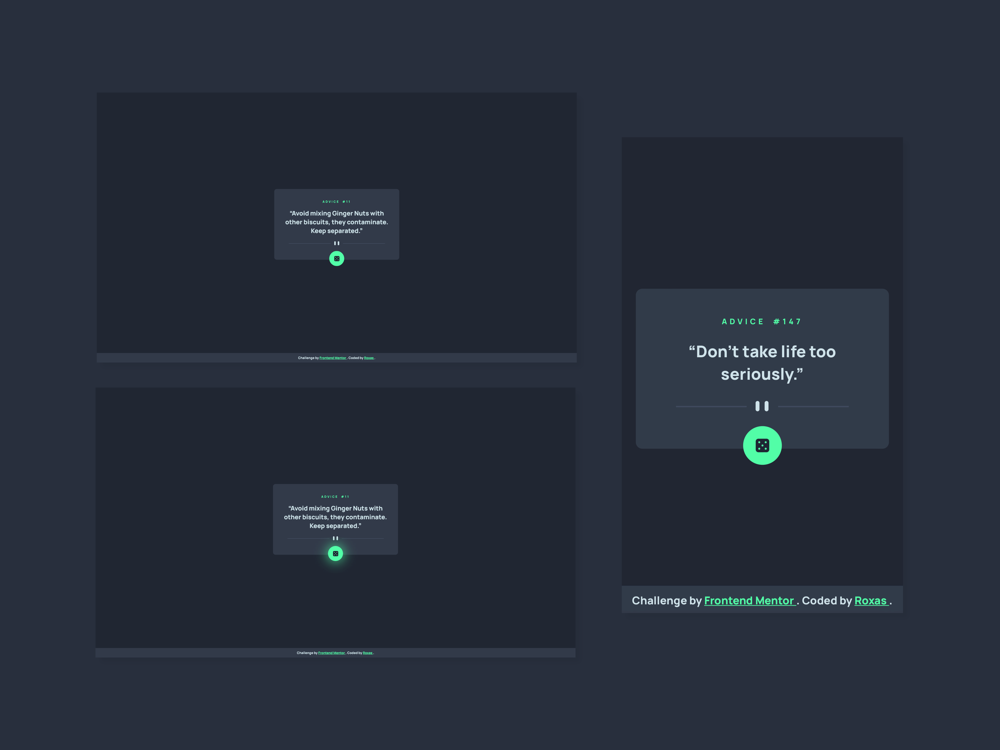

# Frontend Mentor - Advice generator app

This is a solution to the [Advice generator app challenge on Frontend Mentor](https://www.frontendmentor.io/challenges/advice-generator-app-QdUG-13db).

## Table of contents

- [Overview](#overview)
  - [The challenge](#the-challenge)
  - [Screenshot](#screenshot)
  - [Links](#links)
- [My process](#my-process)
  - [Built with](#built-with)
  - [Some insights](#some-insights)
  - [Useful resources](#useful-resources)
  - [Known issues](#known-issues)

## Overview

### The challenge

Users should be able to:

- Generate a new random piece of advice by clicking the dice icon (advice is cached for 2 seconds) taken from the [Advice Slip API](https://api.adviceslip.com/)
- View the optimal layout for the content depending on their device’s screen size
- See hover states for all interactive elements on the page

### Screenshot

### Links

You can check my solution here: [https://roxaskh.github.io/Advice-Generator/](https://roxaskh.github.io/Advice-Generator/)

## My process

### Built with

- HTML5
- CSS3 (& Flexbox)
- JavaScript

### Some insights

The container div is centered using the top and left CSS properties set on 50% and CSS transformations to center it properly.

The program makes use of the [Fetch API](https://developer.mozilla.org/en-US/docs/Web/API/Fetch_API/Using_Fetch) function to get the advice data from the Avice Slip API as a [Slip JSON object](https://api.adviceslip.com/#object-slip).

The dice was made completely in CSS using [Flexbox](https://developer.mozilla.org/en-US/docs/Web/CSS/CSS_Flexible_Box_Layout/Basic_Concepts_of_Flexbox).
You can find a detailed guide [here](https://betterprogramming.pub/creating-dice-in-flexbox-in-css-a02a5d85e516).
A different approach exploiting [CSS Grid](https://dev.to/ekeijl/creating-dice-using-css-grid-j4) instead of Flexbox exists as well if you're interested.

The fancy divider was also made in CSS because why not.

### Useful resources

- [Single Element Spinning 3D Dice](https://alvaromontoro.com/blog/67992/single-element-dice-with-css) - Not really useful but you can make a 3D spinning dice with CSS. Just wanted to share. Watch it spin.

### Known issues

Some scandinavian letters in a couple of advices like the ä in this example don't load up correctly. I'm not sure whether this is a problem on my end as the [meta charset](https://developer.mozilla.org/en-US/docs/Web/HTML/Element/meta#attr-charset) is set to `utf-8` in the HTML document.

